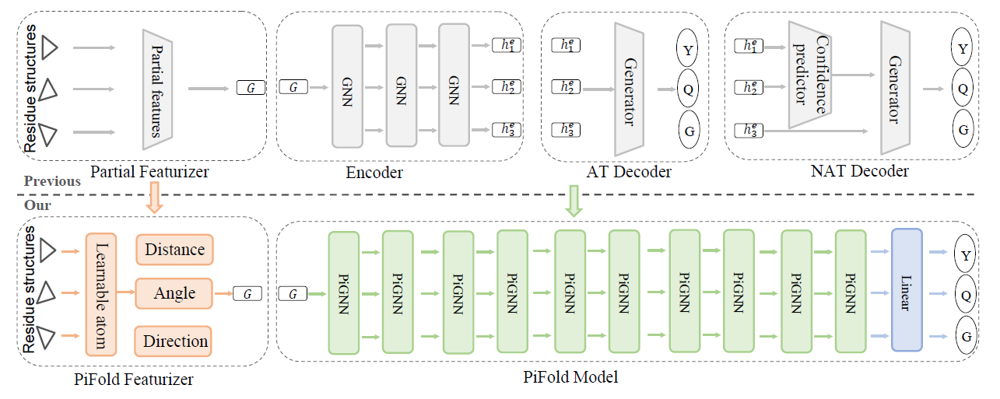

# pifold-pytorch

[](https://github.com/Lightning-AI/lightning)



An unofficial re-implementation of PiFold, a fast inverse-folding algorithm for protein sequence design, in PyTorch.

## Installation

```bash
$ pip install pifold-pytorch
```

## Usage

```python
WIP
```

## Citation
```bibtex
@article{gao2022pifold,
  title={PiFold: Toward effective and efficient protein inverse folding},
  author={Gao, Zhangyang and Tan, Cheng and Li, Stan Z},
  journal={arXiv preprint arXiv:2209.12643},
  year={2022}
}
```